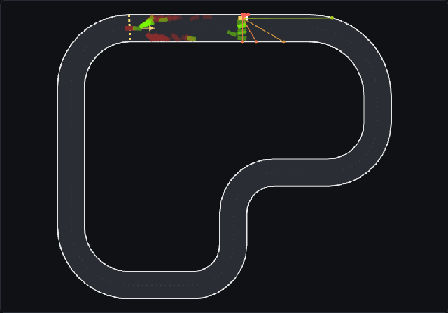
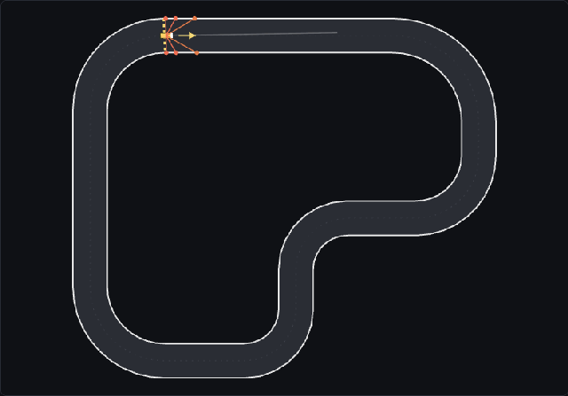
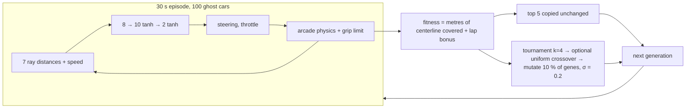

# apex-evolve

**100 cars, each steered by a 112-parameter neural network, learn a race track by
evolution — no ML libraries, no backpropagation, and every run reproducible
bit-for-bit in any browser from a URL.**

<p>
  <a href="https://apex-evolve.vercel.app"><strong>▶ Live demo: apex-evolve.vercel.app</strong></a>
  &nbsp;·&nbsp;
  <a href="https://apex-evolve.vercel.app/?seed=43">fast learner</a>
  &nbsp;·&nbsp;
  <a href="https://apex-evolve.vercel.app/?seed=42&crossover=1">crossover on</a>
  &nbsp;·&nbsp;
  <a href="https://apex-evolve.vercel.app/?seed=43&track=heldout">held-out track</a>
  &nbsp;·&nbsp;
  <a href="https://github.com/wjesseclements/apex-evolve/actions/workflows/ci.yml"></a>
</p>

| Generation 1 — random networks crash and stall | Generation 70 — the pack laps (seed 42) |
|---|---|
|  |  |

## What it is

A browser simulation (Vite + TypeScript + Canvas 2D, React only for the
controls) in which a population of cars evolves a driving policy through a
genetic algorithm written from scratch. Each car sees seven distances to the
track edges and its own speed; a tiny feed-forward network turns that into
steering and throttle. Every 30-second episode, the best five networks
survive unchanged and the other ninety-five are mutated copies of tournament
winners. Nothing is trained by gradient; the driving is *selected*.

The physics is a deliberately simple arcade model with one twist that makes
racing lines matter — a **grip limit** (lateral acceleration ≤ 20 m/s²): at
speed the car understeers, so it has to lift or brake for corners. On the
benchmark seed (42) the population is stuck in front of one corner for sixty
generations, then breaks through; the landing page shows exactly that at 16×
and slows to real time when the first lap happens.

Why build it: the follow-up project solves the same task with PPO, so the
simulation core (`src/sim/`) is kept pure and headless — no DOM, no timers,
no `Math.random`, no engine-dependent math — so both learners can be compared
on identical, reproducible ground.

## Try it in 60 seconds

1. Open the [demo](https://apex-evolve.vercel.app). It starts at 16×; the
   "What am I looking at?" box explains the picture; a hint tells you why
   nothing laps yet. When the first lap arrives (~40 s) it slows to real time.
2. Click any car to inspect its steering, throttle and brake bars. `Esc`
   deselects. `S` toggles the sensor rays, `D` the debug overlay
   (checkpoints, edges), `space` pauses, `1`–`4` set the speed.
3. Type a seed and press Enter — the URL becomes `?seed=…`; that link replays
   the identical evolution for anyone, in any browser. Flip **crossover** and
   watch the same seed escape the plateau fifty generations earlier.
4. **Test best on B** carries the champion onto the held-out track. **Export**
   downloads the best genome as JSON with honest metadata; **Import** drops a
   genome into car #0 of a restarted episode.
5. **Drive** mode: race the algorithm yourself with the arrow keys (you have
   to brake now).

## How the learning works



- **Genome:** all 112 weights and biases as one `Float32Array`; the network is
  a forward pass and nothing else (`src/sim/nn`).
- **Fitness:** progress along the centerline (checkpoints every 5 m, counted
  only when crossed forward and in order — driving backwards or in circles
  earns nothing) plus `2000 / bestLapSeconds` once a car has lapped.
- **Episode end:** the 30 s timer, or every car dead — by touching a wall or by
  the stall rule (below 0.5 m/s for 3 s of simulated time).
- **Selection:** elitism 5, tournament k = 4, uniform crossover behind a flag
  (off by default), per-gene Gaussian mutation p = 0.1, σ = 0.2. All
  randomness flows through one seeded PRNG (mulberry32).
- **Cars are ghosts:** they never collide with each other; the population is
  100 independent trials of the same 30 seconds.

Defaults live in one typed module, [`src/sim/config.ts`](src/sim/config.ts).

## Findings (details and tables in [docs/FINDINGS.md](docs/FINDINGS.md))

- **Crossover escapes the plateau 50 generations earlier.** On seed 42,
  mutation alone laps at generation 60; the same seed with uniform crossover
  laps at generation 10. This is the project's headline result, and it exists
  because crossover is a default-off flag: same seed, one bit, otherwise
  bit-identical runs.
- **The grip limit turns "steer" into "lift, then steer".** Without it the
  champion runs 100 % throttle and laps in 13.6 s at an average of 32.3 m/s on
  a 30 m/s car — an inside line ~7 % shorter than the centerline that nobody
  asked for. With it, champions coast for a quarter to a third of the lap and
  tap the brake at two corner entries; laps take ~18–19 s and keep improving
  with generations.
- **The lap-time bonus was tested and found unnecessary** — bonus on vs off
  gives identical selection through 90 generations because progress already
  ranks lap speed in a 30 s episode. Kept because the spec defines fitness that
  way; not oversold.
- **Generalization:** trained on track A, 3 of 4 champions that had learned A
  also lapped the never-seen, counter-clockwise track B; 2 of 3 in the other
  direction. Failures crash at one specific corner. Protocol fixed before
  running.
- **Three geometry bugs were caught by property sweeps over the real track**
  (rays, containment, and a tilt that would have read as a bug) — none by the
  hand-computed cases.

## Determinism

Same seed ⇒ the same run, **bit-for-bit, on every JavaScript engine**. `sim/`
never calls `Math.sin/cos/exp/log/…` (ECMA-262 lets engines differ in the last
bits, and they do); it uses its own fdlibm-derived kernels in
[`src/sim/math/dmath.ts`](src/sim/math/dmath.ts) built from IEEE-754 basic
arithmetic only. Exact golden pins — physics trajectories, sensor readings,
PRNG streams, GA outputs, generation records — are checked on macOS/arm64
and Linux/x64 CI. That is what makes `?seed=…` a shareable experiment. See
[docs/CONVENTIONS.md](docs/CONVENTIONS.md).

## Reproduce the numbers

```bash
node scripts/evolve-headless.ts 100 42            # gen-by-gen table, seed 42, defaults
node scripts/evolve-headless.ts 60 42 1           # …with crossover on
node scripts/inspect-champion.ts 100 42           # brake / coast / speed, where it brakes
node scripts/generalize.ts                        # train A → test B and B → A, seeds 42–46
```

(Node ≥ 22.18; the scripts import the sim directly, no build step.)

## Sensors, progress and physics in one breath

Seven rays from the car centre at −90°…+90° (negative = the car's left) report
distance to the rendered edge normalized by 60 m; rays are cast exactly by
walking the per-segment drivable quads. Collision uses the four body corners,
so a head-on forward ray reads ~2 m at impact. Physics per fixed 1/60 s tick:
throttle/brake → clamp → drag → yaw (`ω = steering·steerRate·v/vMax`, then
`|ω| ≤ A/v`) → translate. Coordinates: metres, +y down, heading 0 = east,
positive steering = right. All of it is documented in
[docs/CONVENTIONS.md](docs/CONVENTIONS.md).

## Testing strategy

Every geometry module has hand-computed cases on a 100 m square **and** a
property/invariant sweep over the real tracks; the sweeps are what found the
bugs. Bit-exact goldens guard determinism across engines. Purity of `sim/` is
enforced by ESLint rules and a CI grep (no DOM, no timers, no `Math.random`,
no engine-dependent math, no type assertions). ~330 tests, ~30 s.

## Layout

```
src/sim/     pure, headless simulation
  config.ts    every constant, typed, documented with units (+ BENCHMARK)
  math/        vec2 + dmath.ts (deterministic sin/cos/atan2/exp/tanh/log)
  random/      seeded PRNG (mulberry32) — the only source of randomness
  physics/     arcade car model with the grip limit
  track/       track JSON → mitered edges; localized collision; checkpoints + progress
  sensors/     quad-walk raycast + the 8 NN inputs
  nn/          8→10→2 tanh network, Float32Array genome, JSON export format
  ga/          tournament / elitism / uniform crossover / Gaussian mutation
  engine/      World (fixed-timestep, N ghost cars) and Evolution (episodes → scoring → breeding)
src/render/  Canvas 2D: track, cars, rays, checkpoints, fitness chart, hit-testing
src/ui/      React chrome; the rAF/accumulator loop (the only place wall-clock time exists);
             Evolve / Drive sessions, zustand store, inspector, run controls, explainer
scripts/     gen-track.ts, evolve-headless.ts, inspect-champion.ts, generalize.ts, purity grep
docs/        CONVENTIONS.md, FINDINGS.md, BLOG_OUTLINE.md, media/
```

## Development

```bash
npm install
npm run dev        # Vite dev server
npm run check      # typecheck + lint + format + purity + tests + build (what CI runs)
```

## Process

Built slice-by-slice under the engineering working agreement in
[CLAUDE.md](CLAUDE.md), the design in [SPEC.md](SPEC.md), the build plan in
[SLICES.md](SLICES.md), and the kickoff instructions in
[KICKOFF.md](KICKOFF.md): plan gate → autonomous execution → demo gate with
human-eyes verification, every PR CI-gated and squash-merged. The methodology
trail is part of the artifact.
